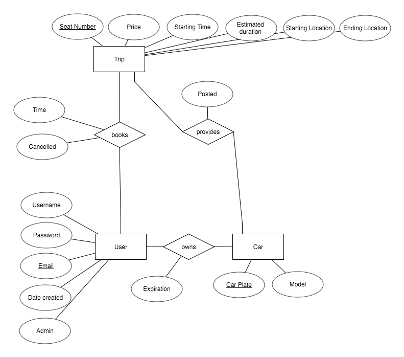

# CarPooling

Currently, the user and password for PostgresSQL are both assumed to be 'postgres'.



The relations are:
```
Car(car_plate VARCHAR(10) PRIMARY KEY, model VARCHAR(32))
User(email VARCHAR(32) PRIMARY KEY, username VARCHAR(32), password VARCHAR(32), created_date DATE, admin BOOLEAN)
Provides_Trip(seat_no INTEGER, price DECIMAL(10, 2), start_time DATETIME, end_time DATETIME, start_loc VARCHAR(32), end_loc VARCHAR(32), posted BOOLEAN, car_plate VARCHAR(10), PRIMARY KEY(seat_no, car_plate), FOREIGN KEY(car_plate) REFERENCES Car(car_plate))
Booking(seat_no INTEGER, email VARCHAR(32), time DATETIME, cancelled BOOLEAN, PRIMARY KEY(seat_no, email), FOREIGN KEY (seat_no) REFERENCES Provides_Trip(seat_no), FOREIGN KEY(email) REFERENCES User(email))
Ownership(email VARCHAR(32), car_plate VARCHAR(10), expiration DATETIME, PRIMARY KEY(email, car_plate), FOREIGN KEY(email) REFERENCES User(email), FOREIGN KEY(car_plate REFERENCES Car(car_plate))
```
