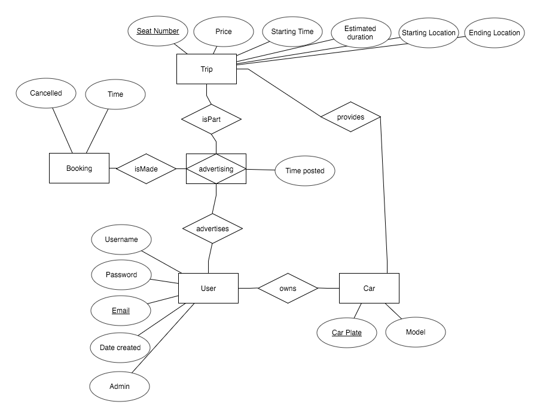

# CarPooling

Currently, the user and password for PostgresSQL are both assumed to be 'postgres'.



The relations are:
```
Car(car_plate VARCHAR(10) PRIMARY KEY, model VARCHAR(32));

User(email VARCHAR(32) PRIMARY KEY, password VARCHAR(32), created_date DATE, admin BOOLEAN);

Make_Transaction(email VARCHAR(32), time DATETIME, amount DECIMAL(10,2));

Provides_Trip(seat_no INTEGER, price DECIMAL(10, 2), start_time DATETIME, end_time DATETIME, start_loc VARCHAR(32), end_loc VARCHAR(32), posted BOOLEAN, car_plate VARCHAR(10), PRIMARY KEY(seat_no, car_plate), FOREIGN KEY(car_plate) REFERENCES Car(car_plate));

Booking(seat_no INTEGER, car_plate VARCHAR(10), start_time DATETIME, email VARCHAR(32), time DATETIME, PRIMARY KEY(seat_no, car_plate, email, time), FOREIGN KEY (seat_no, car_plate, start_time) REFERENCES Provides_Trip(seat_no, car_plate, start_time), FOREIGN KEY(email, time) REFERENCES Make_Transaction(email, time));

Ownership(email VARCHAR(32), car_plate VARCHAR(10), expiration DATE, PRIMARY KEY(email, car_plate), FOREIGN KEY(email) REFERENCES User(email), FOREIGN KEY(car_plate REFERENCES Car(car_plate));
```

SQL DDL:
_Simply copy and paste this and execute as SQL in pgAdmin._
```
CREATE TABLE Car(
  car_plate VARCHAR(10) PRIMARY KEY,
  model VARCHAR(32) NOT NULL
);

CREATE TABLE "user"(
  email VARCHAR(32) PRIMARY KEY,
  password VARCHAR(32) NOT NULL,
  created_date DATE NOT NULL DEFAULT now(),
  admin BOOLEAN NOT NULL
);

CREATE TABLE Make_Transaction(
  email VARCHAR(32) NOT NULL,
  time TIMESTAMP NOT NULL DEFAULT now(),
  amount DECIMAL(10,2) NOT NULL,
  PRIMARY KEY(email, time),
  FOREIGN KEY(email) REFERENCES "user"(email)
);

CREATE TABLE Provides_Trip(
  seat_no INTEGER,
  car_plate VARCHAR(10),
  price DECIMAL(10, 2) NOT NULL,
  start_time TIMESTAMP NOT NULL,
  end_time TIMESTAMP NOT NULL,
  start_loc VARCHAR(32) NOT NULL,
  end_loc VARCHAR(32) NOT NULL,
  posted BOOLEAN NOT NULL,
  PRIMARY KEY(seat_no, car_plate, start_time),
  FOREIGN KEY(car_plate) REFERENCES Car(car_plate)
);

CREATE TABLE Booking(
  seat_no INTEGER,
  car_plate VARCHAR(10),
  start_time TIMESTAMP,
  email VARCHAR(32),
  time TIMESTAMP,
  PRIMARY KEY(seat_no, car_plate, start_time, email, time),
  FOREIGN KEY (seat_no, car_plate, start_time) REFERENCES Provides_Trip(seat_no, car_plate, start_time),
  FOREIGN KEY(email, time) REFERENCES Make_Transaction(email, time)
);

CREATE TABLE Ownership(
  email VARCHAR(32),
  car_plate VARCHAR(10),
  expiration DATE NOT NULL,
  PRIMARY KEY(email, car_plate),
  FOREIGN KEY(email) REFERENCES "user"(email),
  FOREIGN KEY(car_plate) REFERENCES Car(car_plate)
);
```

Currently identified problems:
- Table results are all in 1 page, which is bad when there are alot of records
  - this is applicable for ALL views (except maybe not so urgent for myvehicles)
- Vehicles cannot be deleted even when they are not used
- Error messages when trying to add/delete trips are not specific enough
  - e.g. trips that are already booked cannot be deleted
- Login page is not styled
- Admin does not have rights to delete any records
- Searches are still minimal
  - Include search by source/destination? user? price?
  - Applicable for all views
- Users can still book their own trip (heh)
- Results are by per-seat basis (each seat has a different record)
  - We might want to combine some search results into 1 record with the running seat count instead
  - I think this is mainly applicable for index.php and mytrips.php only
- mybookings.php might want to include more trip details

- <s>Bookings cannot be cancelled (are we implementing this?)</s>
