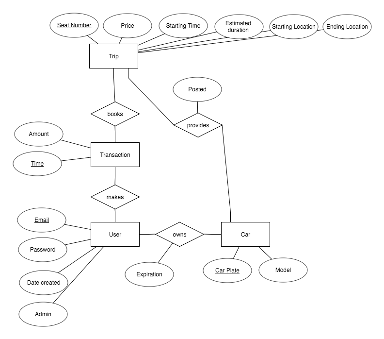

# CarPooling

Currently, the user and password for PostgresSQL are both assumed to be 'postgres'.



The relations are:
```
Car(car_plate VARCHAR(10) PRIMARY KEY, model VARCHAR(32));

User(email VARCHAR(32) PRIMARY KEY, password VARCHAR(32), created_date DATE, admin BOOLEAN);

Make_Transaction(email VARCHAR(32), time DATETIME, amount DECIMAL(10,2));

Provides_Trip(seat_no INTEGER, price DECIMAL(10, 2), start_time DATETIME, end_time DATETIME, start_loc VARCHAR(32), end_loc VARCHAR(32), posted BOOLEAN, car_plate VARCHAR(10), PRIMARY KEY(seat_no, car_plate), FOREIGN KEY(car_plate) REFERENCES Car(car_plate));

Booking(seat_no INTEGER, email VARCHAR(32), time DATETIME, cancelled BOOLEAN, PRIMARY KEY(seat_no, email), FOREIGN KEY (seat_no, car_plate) REFERENCES Provides_Trip(seat_no, car_plate), FOREIGN KEY(email, time) REFERENCES Make_Transaction(email, time));

Ownership(email VARCHAR(32), car_plate VARCHAR(10), expiration DATE, PRIMARY KEY(email, car_plate), FOREIGN KEY(email) REFERENCES User(email), FOREIGN KEY(car_plate REFERENCES Car(car_plate));
```

SQL DDL:
```
CREATE TABLE Car(
  car_plate VARCHAR(10) PRIMARY KEY,
  model VARCHAR(32) NOT NULL
);

CREATE TABLE "user"(
  email VARCHAR(32) PRIMARY KEY,
  password VARCHAR(32) NOT NULL,
  created_date DATE NOT NULL DEFAULT now(),
  admin BOOLEAN NOT NULL
);

CREATE TABLE Make_Transaction(
  email VARCHAR(32) NOT NULL,
  time TIMESTAMP NOT NULL DEFAULT now(),
  amount DECIMAL(10,2) NOT NULL,
  PRIMARY KEY(email, time),
  FOREIGN KEY(email) REFERENCES "user"(email)
);

CREATE TABLE Provides_Trip(
  seat_no INTEGER,
  car_plate VARCHAR(10),
  price DECIMAL(10, 2) NOT NULL,
  start_time TIMESTAMP NOT NULL,
  end_time TIMESTAMP NOT NULL,
  start_loc VARCHAR(32) NOT NULL,
  end_loc VARCHAR(32) NOT NULL,
  posted BOOLEAN NOT NULL,
  PRIMARY KEY(seat_no, car_plate),
  FOREIGN KEY(car_plate) REFERENCES Car(car_plate)
);

CREATE TABLE Booking(
  seat_no INTEGER,
  email VARCHAR(32),
  time TIMESTAMP,
  car_plate VARCHAR(10) NOT NULL,
  cancelled BOOLEAN NOT NULL,
  PRIMARY KEY(seat_no, car_plate, email, time),
  FOREIGN KEY (seat_no, car_plate) REFERENCES Provides_Trip(seat_no, car_plate),
  FOREIGN KEY(email, time) REFERENCES Make_Transaction(email, time)
);

CREATE TABLE Ownership(
  email VARCHAR(32),
  car_plate VARCHAR(10),
  expiration DATE NOT NULL,
  PRIMARY KEY(email, car_plate),
  FOREIGN KEY(email) REFERENCES "user"(email),
  FOREIGN KEY(car_plate) REFERENCES Car(car_plate)
);
```
